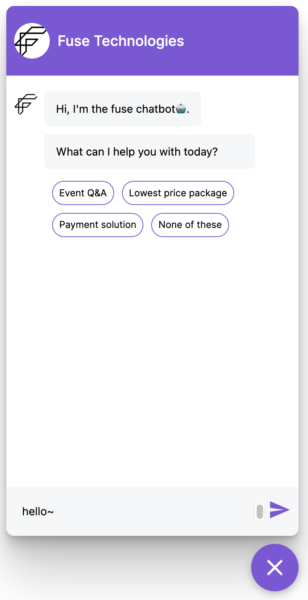

# rasa-webchat-customize-css

A simple css file to customize the [rasa webchat widget](https://github.com/botfront/rasa-webchat)

_I'm not a css expert and I can only use the basic css technologies. I'll be very happy if this tiny work can help someone._



## Usage

- Copy the css file to project
- Link the css file in your html files

```html
<!DOCTYPE html>
<html>
  <head>
    <link rel="stylesheet" href="./css/rasa-webchat-customize.css" />
  </head>
  <body>
    <!-- Your HTML content here -->
  </body>
</html>
```

You should define a variable called **--color-primary** in your css file or you can just replace the **--color-primary** with the specific color.

```css
:root {
  --color-primary: gold;
}
```

For rich content, this file only change the styles of text and button. I may add more content in the future:).
